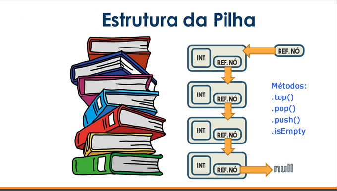

# estrutura-dados
Mecanismos de organização de dados que atendem diferentes requisitos

### TIPOS DE ESTRUTURA

#### PILHA (LIFO)

	
#### FILA (FIFO)

	
#### LISTA ENCADEADA

	
#### LISTA DUPLAMENTE ENCADEADA

#### LISTA CIRCULAR

#### ÁRVORE BINÁRIA

